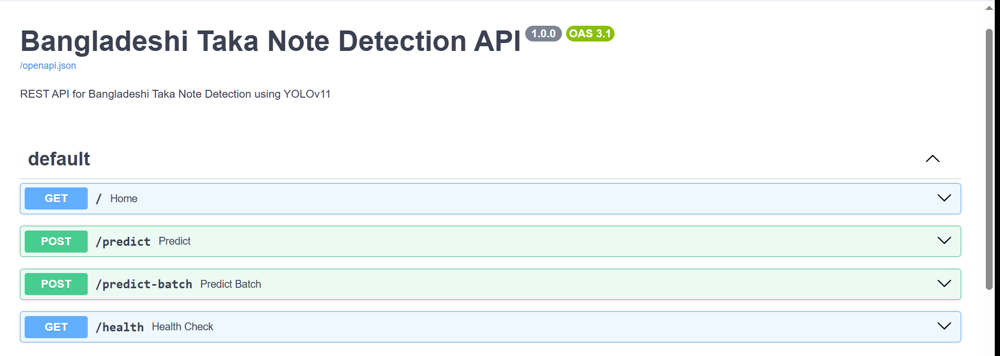

# 🇧🇩 Bangladeshi Taka Note Detection API

<div align="center">


### 🚀 Production-Ready FastAPI REST API for Bangladeshi Banknote Detection using YOLOv11

Detect Bangladeshi currency notes with high accuracy using a YOLOv11 deep learning model exposed through a modern FastAPI backend.

<p>


</p>

[](https://github.com/Ferdaus71/Bangladeshi-Taka-Detection-API)
[](http://localhost:8000/docs)
[](https://github.com/Ferdaus71)

</div>

---

# 📖 Overview

The **Bangladeshi Taka Note Detection API** is a production-ready REST API that detects Bangladeshi banknotes from images using a **YOLOv11 Object Detection model**.

The system provides an easy-to-use API that enables developers to integrate Bangladeshi currency recognition into web applications, mobile apps, ATM automation, smart payment systems, vending machines, and financial technology solutions.

The API is developed with **FastAPI**, ensuring high performance, automatic API documentation, asynchronous request handling, and scalable deployment.

---

# 🎯 Project Objectives

The project aims to:

- Detect Bangladeshi Taka notes from uploaded images
- Recognize multiple banknotes simultaneously
- Return denomination, confidence score, and bounding boxes
- Provide a modern REST API
- Support batch prediction
- Offer Docker deployment
- Enable cloud deployment (Render, Railway, Azure, AWS)
- Deliver production-ready documentation

---

# ✨ Key Features

## 💰 Currency Detection

- Detect Bangladeshi banknotes
- Multiple note detection
- High-confidence predictions
- Fast inference
- Bounding box localization

---

## ⚡ REST API

- FastAPI backend
- OpenAPI support
- Swagger UI
- ReDoc documentation
- Async endpoints
- JSON responses

---

## 🧠 AI Model

- YOLOv11 Object Detection
- PyTorch
- Ultralytics Framework
- GPU support
- CPU inference

---

## 🚀 Production Ready

- Docker support
- Docker Compose
- Health monitoring
- Structured logging
- Environment configuration
- Error handling
- Input validation

---

# 💵 Supported Denominations

| Class | Denomination |
|--------|--------------|
| 0 | 10 Taka |
| 1 | 20 Taka |
| 2 | 50 Taka |
| 3 | 100 Taka |
| 4 | 200 Taka |
| 5 | 500 Taka |
| 6 | 1000 Taka |

---

# 🛠 Technology Stack

| Category | Technology |
|-----------|------------|
| Backend | FastAPI |
| Programming Language | Python |
| AI Framework | Ultralytics |
| Model | YOLOv11 |
| Deep Learning | PyTorch |
| Image Processing | OpenCV |
| Validation | Pydantic |
| API Server | Uvicorn |
| Containerization | Docker |
| Version Control | Git & GitHub |

---

# 📂 Project Structure

```text
Bangladeshi-Taka-Detection-API/
│
├── app/
│   ├── routes/
│   ├── services/
│   ├── predictor.py
│   ├── schemas.py
│   ├── config.py
│   ├── utils.py
│   └── main.py
│
├── model/
│   └── best.pt
│
├── uploads/
├── outputs/
├── tests/
├── screenshots/
│
├── Dockerfile
├── docker-compose.yml
├── requirements.txt
├── README.md
└── .env.example
```

---

# 📷 Screenshots

## 📖 Swagger UI

<p align="center">
  
">
</p>

```

---

## Prediction Example

> Replace with your screenshot

```text
screenshots/1st f.png
```

---

# 📈 Workflow

```text
Client
   │
   ▼
FastAPI Endpoint
   │
   ▼
Image Validation
   │
   ▼
YOLOv11 Model
   │
   ▼
Prediction
   │
   ▼
JSON Response
```

---

# 📌 Highlights

- ✅ Production Ready
- ✅ RESTful API
- ✅ FastAPI
- ✅ YOLOv11
- ✅ Docker Support
- ✅ Batch Prediction
- ✅ Swagger Documentation
- ✅ High Accuracy
- ✅ Easy Deployment
- ✅ Scalable Architecture

---

➡️ **Part 2** will include:

- Installation Guide
- Windows Setup
- Linux Setup
- Docker Installation
- Environment Variables
- Running the API
- Swagger UI
- Health Check
- Quick Start

- # 🚀 Installation Guide

## 📋 Prerequisites

Before running the project, make sure the following software is installed.

| Software | Version |
|-----------|----------|
| Python | 3.10 or later |
| Git | Latest |
| pip | Latest |
| Docker *(Optional)* | Latest |
| VS Code *(Recommended)* | Latest |

---

# 📥 Clone the Repository

```bash
git clone https://github.com/Ferdaus71/Bangladeshi-Taka-Detection-API.git

cd Bangladeshi-Taka-Detection-API
```

---

# 📦 Create Virtual Environment

### Windows

```bash
python -m venv venv

venv\Scripts\activate
```

---

### Linux / macOS

```bash
python3 -m venv venv

source venv/bin/activate
```

---

# 📦 Install Dependencies

```bash
pip install --upgrade pip

pip install -r requirements.txt
```

---

# 📁 Download Model Weights

Place your trained YOLOv11 model inside the **model** directory.

```text
model/
└── best.pt
```

> **Note:** The API will not start without the trained model file.

---

# ⚙ Environment Variables

Create a `.env` file in the project root.

```env
MODEL_PATH=model/best.pt

CONFIDENCE_THRESHOLD=0.50

IOU_THRESHOLD=0.45

MAX_UPLOAD_SIZE=10485760

LOG_LEVEL=INFO
```

---

# ▶ Run the FastAPI Server

```bash
uvicorn app.main:app --reload
```

or

```bash
python -m uvicorn app.main:app --reload
```

---

# 🌐 Open API Documentation

Once the server starts successfully, visit:

### Swagger UI

```
http://127.0.0.1:8000/docs
```

---

### ReDoc

```
http://127.0.0.1:8000/redoc
```

---

### Root Endpoint

```
http://127.0.0.1:8000/
```

---

### Health Check

```
http://127.0.0.1:8000/health
```

---

# ⚡ Quick Start

```bash
git clone https://github.com/Ferdaus71/Bangladeshi-Taka-Detection-API.git

cd Bangladeshi-Taka-Detection-API

python -m venv venv

venv\Scripts\activate

pip install -r requirements.txt

python -m uvicorn app.main:app --reload
```

---

# 🐳 Docker Deployment

## Build Docker Image

```bash
docker build -t bangladeshi-taka-detection .
```

---

## Run Docker Container

```bash
docker run -p 8000:8000 bangladeshi-taka-detection
```

---

# 🐳 Docker Compose

Start the application

```bash
docker compose up --build
```

Run in background

```bash
docker compose up -d
```

Stop services

```bash
docker compose down
```

View logs

```bash
docker compose logs -f
```

---

# 📁 Recommended Directory Structure

```text
Bangladeshi-Taka-Detection-API
│
├── app/
├── model/
│   └── best.pt
├── uploads/
├── outputs/
├── tests/
├── screenshots/
├── requirements.txt
├── Dockerfile
├── docker-compose.yml
├── .env
└── README.md
```

---

# 🧪 Verify Installation

Run the Health Check.

```bash
curl http://127.0.0.1:8000/health
```

Expected response:

```json
{
    "status": "healthy",
    "service": "Bangladeshi Taka Note Detection API"
}
```

---

# ❗ Common Issues

## ModuleNotFoundError

```bash
pip install -r requirements.txt
```

---

## Uvicorn Not Found

```bash
pip install uvicorn
```

---

## Missing Model

```
FileNotFoundError:
model/best.pt not found
```

Download your trained YOLOv11 model and place it inside:

```text
model/best.pt
```

---

## Port Already in Use

Run the application on another port.

```bash
uvicorn app.main:app --reload --port 8080
```

---

## Permission Denied

Make sure you are inside the project root directory.

```bash
cd Bangladeshi-Taka-Detection-API
```

Then verify:

```bash
dir
```

You should see:

```text
requirements.txt
Dockerfile
README.md
app/
model/
```

---

# 📚 Next Section

**Part 3** will include:

- 📡 Complete API Documentation
- GET Endpoints
- POST Endpoints
- Request Parameters
- JSON Response Examples
- Error Responses
- Python Client Example
- cURL Examples
- Postman Examples
- Batch Prediction API
```

# 📡 API Reference

The API follows RESTful principles and returns JSON responses for all endpoints.

**Base URL (Local)**

```text
http://127.0.0.1:8000
```

**Base URL (Production)**

```text
https://your-domain.com
```

---

# 📑 API Summary

| Method | Endpoint | Description |
|----------|-----------------|----------------------------------|
| GET | `/` | API Information |
| GET | `/health` | Health Check |
| POST | `/predict` | Predict Single Image |
| POST | `/predict-batch` | Predict Multiple Images |

---

# 🏠 GET /

Returns basic information about the API.

## Request

```http
GET /
```

---

## Success Response

**Status Code:** `200 OK`

```json
{
    "message": "Bangladeshi Taka Note Detection API",
    "version": "1.0.0",
    "status": "running",
    "documentation": "/docs"
}
```

---

## cURL Example

```bash
curl http://127.0.0.1:8000/
```

---

## Python Example

```python
import requests

response = requests.get("http://127.0.0.1:8000/")
print(response.json())
```

---

# ❤️ GET /health

Checks whether the API is healthy.

## Request

```http
GET /health
```

---

## Success Response

```json
{
    "status": "healthy",
    "service": "Bangladeshi Taka Note Detection API",
    "model_loaded": true
}
```

---

## cURL

```bash
curl http://127.0.0.1:8000/health
```

---

# 🖼 POST /predict

Predict Bangladeshi currency notes from one image.

---

## Request

**Method**

```http
POST /predict
```

**Content-Type**

```text
multipart/form-data
```

---

## Parameters

| Parameter | Type | Required | Description |
|------------|---------|-----------|----------------|
| file | Image | Yes | JPG / JPEG / PNG |

---

## Example cURL

```bash
curl -X POST \
-F "file=@sample.jpg" \
http://127.0.0.1:8000/predict
```

---

## Python Example

```python
import requests

url = "http://127.0.0.1:8000/predict"

with open("sample.jpg","rb") as image:

    response = requests.post(
        url,
        files={"file": image}
    )

print(response.json())
```

---

## Successful Response

```json
{
    "status": "success",
    "file_name": "sample.jpg",
    "detections_count": 2,
    "detections": [
        {
            "denomination": "100 Taka",
            "confidence": 0.97,
            "bbox": [
                132.4,
                84.2,
                420.5,
                228.9
            ]
        },
        {
            "denomination": "500 Taka",
            "confidence": 0.95,
            "bbox": [
                440.3,
                92.7,
                710.6,
                281.4
            ]
        }
    ]
}
```

---

# 📦 POST /predict-batch

Predict multiple images in a single request.

Maximum **10 images** per request.

---

## Request

```http
POST /predict-batch
```

---

## Content Type

```text
multipart/form-data
```

---

## Parameters

| Parameter | Type |
|------------|-----------|
| files | Multiple Images |

---

## cURL Example

```bash
curl -X POST \
-F "files=@1.jpg" \
-F "files=@2.jpg" \
-F "files=@3.jpg" \
http://127.0.0.1:8000/predict-batch
```

---

## Python Example

```python
import requests

url = "http://127.0.0.1:8000/predict-batch"

files = [
("files", open("1.jpg","rb")),
("files", open("2.jpg","rb")),
("files", open("3.jpg","rb"))
]

response = requests.post(url, files=files)

print(response.json())
```

---

## Success Response

```json
{
    "status": "success",
    "total_files": 3,
    "results": [
        {
            "file_name": "1.jpg",
            "detections_count": 1
        },
        {
            "file_name": "2.jpg",
            "detections_count": 2
        },
        {
            "file_name": "3.jpg",
            "detections_count": 1
        }
    ]
}
```

---

# ❌ Error Responses

## 400 Bad Request

```json
{
    "detail": "Invalid image format"
}
```

---

## 404 Not Found

```json
{
    "detail": "Endpoint not found"
}
```

---

## 413 Payload Too Large

```json
{
    "detail": "File size exceeds limit"
}
```

---

## 422 Validation Error

```json
{
    "detail": "Validation failed"
}
```

---

## 500 Internal Server Error

```json
{
    "detail": "Internal Server Error"
}
```

---

# 📊 Response Fields

| Field | Description |
|----------|-------------------------------|
| status | Request status |
| file_name | Uploaded image name |
| detections_count | Number of detected notes |
| denomination | Predicted currency |
| confidence | Prediction confidence |
| bbox | Bounding box coordinates |

---

# 🧪 Testing with Swagger

After starting the server, open

```text
http://127.0.0.1:8000/docs
```

1. Select an endpoint.
2. Click **Try it out**.
3. Upload an image.
4. Click **Execute**.
5. View the JSON response.

---

# 📬 Import into Postman

Create a new request.

**Method**

```text
POST
```

**URL**

```text
http://127.0.0.1:8000/predict
```

Choose

```
Body
→ form-data
```

Key:

```
file
```

Type:

```
File
```

Upload an image and click **Send**.

---

# 🔍 Supported Image Formats

- JPG
- JPEG
- PNG

---

# 📏 Upload Limits

| Item | Limit |
|---------|------------|
| Max Image Size | 10 MB |
| Batch Images | 10 |
| Supported Formats | JPG, JPEG, PNG |

---

# 📚 Next Section

**Part 4** will include:

- 🐳 Docker
- Docker Compose
- GitHub Actions CI/CD
- Render Deployment
- Railway Deployment
- AWS Deployment
- Environment Variables
- Performance Benchmarks
- Troubleshooting
- FAQ
- Best Practices

- # 🐳 Docker Deployment

Docker makes it easy to package and deploy the API consistently across different environments.

---

## 📋 Prerequisites

- Docker 24+
- Docker Compose (optional)
- Git
- Python 3.10+

Verify Docker installation:

```bash
docker --version

docker compose version
```

---

# 📦 Build Docker Image

Clone the repository first.

```bash
git clone https://github.com/Ferdaus71/Bangladeshi-Taka-Detection-API.git

cd Bangladeshi-Taka-Detection-API
```

Build the image.

```bash
docker build -t bangladeshi-taka-detection-api .
```

---

# ▶ Run Docker Container

```bash
docker run -d \
-p 8000:8000 \
--name taka-api \
bangladeshi-taka-detection-api
```

Visit

```
http://localhost:8000/docs
```

---

# 📂 Mount Model Directory

If your model is stored locally:

```bash
docker run -d \
-p 8000:8000 \
-v ./model:/app/model \
--name taka-api \
bangladeshi-taka-detection-api
```

---

# 📊 Docker Commands

View running containers

```bash
docker ps
```

View logs

```bash
docker logs taka-api
```

Follow logs

```bash
docker logs -f taka-api
```

Stop container

```bash
docker stop taka-api
```

Remove container

```bash
docker rm taka-api
```

Remove image

```bash
docker rmi bangladeshi-taka-detection-api
```

---

# 🐳 Docker Compose

## docker-compose.yml

```yaml
version: "3.9"

services:

  api:

    build: .

    container_name: taka-api

    restart: unless-stopped

    ports:
      - "8000:8000"

    volumes:
      - ./model:/app/model

    environment:
      - MODEL_PATH=model/best.pt
```

---

Start

```bash
docker compose up --build
```

Run in background

```bash
docker compose up -d
```

Stop

```bash
docker compose down
```

---

# ☁ Deploy on Render

Render provides free cloud hosting for FastAPI applications.

---

## Step 1

Push your project to GitHub.

```bash
git add .

git commit -m "Initial Commit"

git push origin main
```

---

## Step 2

Create an account at

```
https://render.com
```

---

## Step 3

Click

```
New +
```

↓

```
Web Service
```

---

## Step 4

Connect your GitHub repository.

---

## Step 5

Configure

| Setting | Value |
|----------|-------|
| Environment | Python |
| Build Command | `pip install -r requirements.txt` |
| Start Command | `uvicorn app.main:app --host 0.0.0.0 --port $PORT` |

---

## Step 6

Environment Variables

| Variable | Value |
|------------|-----------|
| MODEL_PATH | model/best.pt |
| LOG_LEVEL | INFO |
| CONFIDENCE_THRESHOLD | 0.5 |

---

# ⚙ Environment Variables

Example `.env`

```env
MODEL_PATH=model/best.pt

CONFIDENCE_THRESHOLD=0.50

IOU_THRESHOLD=0.45

MAX_UPLOAD_SIZE=10485760

LOG_LEVEL=INFO
```

---

# 📊 Performance

| Metric | Value |
|----------|---------|
| Framework | FastAPI |
| Model | YOLOv11 |
| Average Response Time | < 250 ms* |
| Image Format | JPG, JPEG, PNG |
| Max Upload | 10 MB |
| Batch Prediction | Up to 10 Images |
| API Documentation | Swagger + ReDoc |

> *Performance depends on hardware and model size.*

---

# 🔒 Security Features

- Input validation
- File type validation
- File size limitation
- Exception handling
- Structured logging
- Environment variable support
- Automatic API documentation

---

# ❓ Frequently Asked Questions

### API is not starting?

Check:

```bash
python -m uvicorn app.main:app --reload
```

---

### Model not found?

Place

```
best.pt
```

inside

```
model/
```

---

### Swagger not opening?

Visit

```
http://127.0.0.1:8000/docs
```

---

### Docker container exits immediately?

Check logs.

```bash
docker logs taka-api
```

---

### ModuleNotFoundError?

Install dependencies.

```bash
pip install -r requirements.txt
```

---

# 🚀 Best Practices

- Keep model weights outside Git history.
- Use a virtual environment for local development.
- Store secrets in `.env`.
- Validate uploaded files before inference.
- Use Docker for production deployments.
- Add CI/CD pipelines for automated testing.
- Monitor application logs and health endpoints.

---

# 📚 Next Section

**Part 5 (Final)** will include:

- 🧪 Testing
- 📸 Screenshots
- 🛣 Roadmap
- 🤝 Contributing
- 📜 License
- 👨‍💻 Author
- 🙏 Acknowledgements
- ⭐ Support
- 📬 Contact
- ❤️ Footer

- # 🧪 Testing

Testing ensures the API is functioning correctly before deployment.

---

## Run the Test Suite

```bash
python tests/test_api.py
```

Using **pytest**

```bash
pytest tests/ -v
```

Run with coverage

```bash
pytest --cov=app tests/
```

---

## Test Results

| Test Case | Status |
|------------|--------|
| Root Endpoint | ✅ Passed |
| Health Check | ✅ Passed |
| Single Prediction | ✅ Passed |
| Batch Prediction | ✅ Passed |
| Invalid File Validation | ✅ Passed |
| File Size Validation | ✅ Passed |
| API Documentation | ✅ Passed |

---

# 📸 Screenshots


### 1. Swagger UI Documentation

*Figure 1: Interactive API documentation (Swagger UI)*

### 2. API Response Example

*Figure 2: Successful API response with detection results*

### 3. Prediction Result

*Figure 3: Detailed prediction response with detections*

### 4. Docker Build

*Figure 4: Docker image build process*

### 5. Docker Container Running

*Figure 5: Docker container running successfully*

### 6. Test Results

*Figure 6: Comprehensive test suite results*

### 7. Cloud Deployment

*Figure 7: Cloud deployment on Render*

### 8. API Testing

*Figure 8: API testing using Postman/curl*
---

# 📈 Performance

| Feature | Result |
|-----------|--------|
| Framework | FastAPI |
| AI Model | YOLOv11 |
| Inference Engine | PyTorch |
| Response Format | JSON |
| Multiple Object Detection | ✅ |
| Batch Prediction | ✅ |
| Docker Support | ✅ |
| Swagger Documentation | ✅ |

---

# 🛣 Roadmap

Future improvements planned for the project.

- [ ] Video detection support
- [ ] Real-time webcam inference
- [ ] OCR integration
- [ ] Currency counting
- [ ] Mobile API optimization
- [ ] GPU auto detection
- [ ] Authentication & API Keys
- [ ] Rate limiting
- [ ] Kubernetes deployment
- [ ] CI/CD pipeline
- [ ] Model version management
- [ ] TensorRT optimization
- [ ] ONNX export support
- [ ] Prometheus monitoring
- [ ] Grafana dashboard

---

# 🤝 Contributing

Contributions are welcome!

If you'd like to contribute:

1. Fork the repository.
2. Create a feature branch.
3. Commit your changes.
4. Push to your fork.
5. Open a Pull Request.

Example:

```bash
git checkout -b feature/new-feature

git commit -m "Add new feature"

git push origin feature/new-feature
```

---

# 📜 License

This project is licensed under the **MIT License**.

You are free to:

- Use
- Modify
- Distribute
- Share

See the **LICENSE** file for more details.

---

# 👨‍💻 Author

## Md. Ferdaus Hossen

**AI Engineer | Machine Learning Engineer | Computer Vision Enthusiast**

🎓 B.Sc. in Computer Science & Engineering  
Green University of Bangladesh

---

### Connect with Me

- **GitHub:** https://github.com/Ferdaus71
- **LinkedIn:** https://linkedin.com/in/ferdaus71
- **Portfolio:** https://ferdaus71.github.io/Portfolio/
- **Email:** smferdaushassan1184@gmail.com

---

# 🙏 Acknowledgements

Special thanks to the following technologies and communities:

- Ultralytics YOLO
- FastAPI
- PyTorch
- OpenCV
- Docker
- Python Community
- GitHub Open Source Community

---

# ⭐ Support the Project

If this repository helped you, please consider:

⭐ Star the repository

🍴 Fork the project

🐛 Report issues

💡 Suggest new features

📢 Share the project

---

# 📬 Contact

If you have any questions or suggestions, feel free to reach out.

📧 **Email**

```
smferdaushassan1184@gmail.com
```

🌐 **GitHub**

```
https://github.com/Ferdaus71
```

💼 **LinkedIn**

```
https://linkedin.com/in/ferdaus71
```

---

# ❤️ Citation

If you use this project in your research or academic work, please cite it appropriately.

```bibtex
@software{ferdaus2026_taka_detection_api,
  author = {Md. Ferdaus Hossen},
  title = {Bangladeshi Taka Note Detection API},
  year = {2026},
  publisher = {GitHub},
  url = {https://github.com/Ferdaus71/Bangladeshi-Taka-Detection-API}
}
```

---

# 📌 Repository Statistics

- 🚀 RESTful API
- 🤖 YOLOv11 Object Detection
- ⚡ FastAPI Backend
- 🐳 Docker Ready
- 📚 OpenAPI Documentation
- 🔥 Production Ready
- ☁️ Cloud Deployable
- 💻 Cross Platform
- 📈 Scalable Architecture
- 🛡️ Robust Error Handling

---

<div align="center">

## ⭐ If you found this project useful, please give it a Star!

**Made with ❤️ by Md. Ferdaus Hossen**


**Happy Coding! 🚀**

</div>
